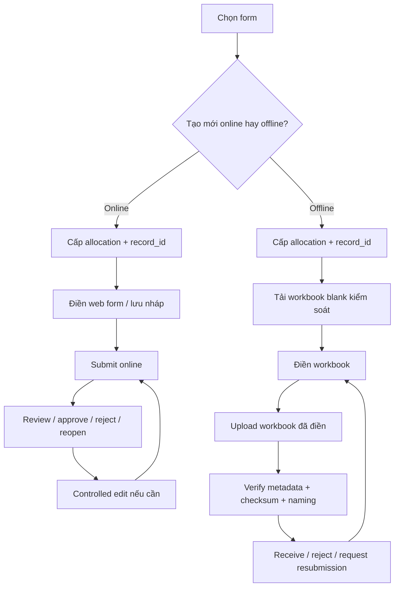

# eQMS Record Lifecycle, Code Registry & Form Operating Model

> Tài liệu chốt logic vận hành cho form online/offline trong module Kiểm soát chứng cứ.
> Mục tiêu: một chuẩn thống nhất cho cấp mã, lưu nháp, nộp, nộp lại, chỉnh sửa có kiểm soát, và quản trị mã đã cấp.

---

## 1. Chuẩn quốc tế dùng làm nền

Các điểm dưới đây là **suy luận thiết kế** từ chuẩn/quy định chính thức, không phải trích nguyên văn naming pattern của cơ quan quản lý:

1. **FDA – Computerized Systems Used in Clinical Trials**
   Nền tảng cho electronic record, audit trail, không che khuất bản cũ, và truy được ai sửa / khi nào / vì sao.
   Nguồn: [FDA guidance](https://www.fda.gov/inspections-compliance-enforcement-and-criminal-investigations/fda-bioresearch-monitoring-information/guidance-industry-computerized-systems-used-clinical-trials)

2. **EU GMP Annex 11 – Computerised Systems**
   Nền tảng cho audit trail, kiểm soát hệ thống điện tử, change control, e-signature, và review dữ liệu.
   Nguồn: [European Commission – EudraLex Volume 4](https://health.ec.europa.eu/medicinal-products/eudralex/eudralex-volume-4_en)

3. **MHRA – Archiving and retention of clinical trial records**
   Bổ sung kỳ vọng mới nhất về lưu trữ, metadata, audit trail và long-term readability.
   Nguồn: [MHRA guidance, updated 26 March 2026](https://www.gov.uk/government/publications/archiving-and-retention-of-clinical-trial-records/archiving-and-retention-of-clinical-trial-records)

4. **ISO 10013:2021 – Guidance for documented information**
   Xác nhận documented information có thể vận hành hoàn toàn trên môi trường số, không bị ràng buộc một hierarchy giấy cố định.
   Nguồn: [ISO announcement](https://committee.iso.org/sites/tc176/home/news/content-left-area/news-and-updates/release-of-iso-100132021-quality.html)

### 1.1 Suy luận áp dụng cho HESEM

1. Form blank và form record phải tách biệt.
2. Một hồ sơ nghiệp vụ phải có mã định danh ổn định xuyên suốt vòng đời.
3. Chỉnh sửa sau submit không được tạo record mới trừ khi là business case mới.
4. Nộp lại phải tăng revision/receipt nội bộ và giữ được bản cũ.
5. Registry phải nhìn được cả online lẫn offline trong cùng một control plane.

---

## 2. Mô hình định danh chuẩn

Hệ thống eQMS của HESEM dùng 4 lớp định danh khác nhau:

### 2.1 Form Code

Định danh của **form blank**.

Ví dụ:

```text
FRM-403
FRM-403-SCAR
FRM-631
```

### 2.2 Record ID

Định danh của **instance hồ sơ** được tạo từ form.

Ví dụ:

```text
SCAR-2026-012
NCR-2026-043
CAPA-2026-008
```

### 2.3 Submission Revision

Áp dụng cho **online form**.

```text
submission_count = 1, 2, 3...
resubmission_count = submission_count - 1
amendment_count = số lần controlled edit sau submit/review/approve
```

### 2.4 Receipt Version

Áp dụng cho **offline workbook** đã upload lại.

```text
receipt_version = R01, R02, R03...
```

### 2.5 Quan hệ với quy tắc ANNEX / tài liệu tham chiếu

`ANNEX-{NNN}` là **document number**, không phải `record_id` của một hồ sơ form.

Vì vậy:

1. `FRM-403` hoặc `FRM-403-SCAR` là **form code**.
2. `SCAR-2026-012` là **record_id** của instance hồ sơ.
3. `ANNEX-401` hoặc `SOP-401` là **document number** trong hệ thống tài liệu.

Hệ quả thiết kế:

1. Tab `Tạo mã` vẫn phải hỗ trợ `ANNEX-NUMBER`, `SOP-NUMBER`, `WI-NUMBER`, `JD-NUMBER`.
2. Tab `Online Form` và `Quản lý mã` chỉ quản lý **record instances** phát sinh từ form.
3. Không được trộn registry mã tài liệu tham chiếu với registry hồ sơ đã cấp của form.

---

## 3. Quy tắc cốt lõi

### 3.1 Không sinh mã mới khi mở lại nháp

`Save draft` chỉ được phép:

1. Ghi local draft.
2. Ghi server draft.
3. Cập nhật `saved_at`, `saved_by`.

`Save draft` tuyệt đối không được:

1. Tăng counter.
2. Tạo `record_id` mới nếu instance đã có `allocation_id`.
3. Tạo allocation mới khi chỉ đơn thuần mở lại hồ sơ cũ.

### 3.2 Online controlled edit sau submit

Nếu form online đã submit rồi mà người dùng vào `Chỉnh sửa có kiểm soát`, logic đúng là:

1. Mở cùng `allocation_id`.
2. Giữ nguyên `record_id`.
3. Tải bản mới nhất của entry hiện hành.
4. Cho phép sửa ở `editMode = true`.
5. Khi submit lại:
   - tăng `submission_count`
   - tăng `resubmission_count`
   - tăng `amendment_count` nếu sửa sau submit/review/approve
   - ghi `source_entry_id` + `source_submission_revision`
   - ghi event vào history

### 3.3 Offline create / return

Khi người dùng chọn `Tạo mới offline`:

1. Hệ thống cấp `allocation_id` + `record_id`.
2. Tải workbook blank đã đóng dấu kiểm soát.
3. Gắn hidden sheet `_QMS_CONTROL`.
4. Khi upload lại:
   - xác minh metadata
   - giữ nguyên `record_id`
   - tăng `receipt_version`
   - tạo server-managed filename mới

### 3.4 Tab Tạo mã không dùng cho form

Tab `Tạo mã` chỉ dùng cho:

1. ANNEX number.
2. Mã vật tư / phôi / tooling / gage / asset.
3. Các record tham khảo khác ngoài form lifecycle.

Form online/offline phải tự cấp mã trong runtime của form.

---

## 4. Sơ đồ vận hành tổng thể



---

## 5. Frontend operating model

### 5.1 Tabs

Module Kiểm soát chứng cứ giữ 6 bề mặt:

1. `Việc của tôi`
2. `Biểu mẫu`
3. `Online Form`
4. `Quản lý mã`
5. `Tải lên`
6. `Tạo mã`

### 5.2 Online Form tab

Phải hỗ trợ:

1. `Tạo mới online`
2. `Tạo mới offline`
3. `Tiếp tục bản nháp`
4. `Quản lý mã đã cấp`

### 5.3 Việc của tôi

Phải nhìn được:

1. Bản nháp cục bộ.
2. Bản nháp server.
3. Hồ sơ đang chờ review.
4. Upload exception.
5. Hồ sơ hoàn thành gần đây.

### 5.4 Quản lý mã

Phải là registry chuẩn cho cả online/offline, với tối thiểu:

1. Mã hồ sơ
2. Form code
3. Delivery mode
4. Workflow state
5. Last activity
6. Submission count
7. Resubmission count
8. Latest file
9. Action mở / chỉnh sửa / tải bản đã nộp

---

## 6. Backend logical data model hiện hành

### 6.1 Runtime stores đang dùng

```text
qms-data/
  counters/                         -> atomic counters
  allocations/                      -> allocation store
  online-forms/
    schemas/                        -> form schemas
    entries/{FORM}.json             -> latest entries by form
    drafts/{allocation_id}.json     -> server drafts
    audit/{FORM}/YYYY-MM.jsonl      -> field audit trail
  config/form_control_registry.json -> blank/offline registry
```

### 6.2 Các object chính

#### Allocation

Đại diện cho instance hồ sơ.

```json
{
  "allocation_id": "uuid",
  "record_id": "SCAR-2026-012",
  "record_type": "SCAR",
  "form_code": "FRM-403",
  "delivery_mode": "online|offline",
  "status": "allocated|submitted|received|approved|rejected|void",
  "history": []
}
```

#### Online entry

Đại diện cho submission mới nhất của online form.

```json
{
  "entry_id": "FRM-403-SCAR-...",
  "allocation_id": "uuid",
  "record_id": "SCAR-2026-012",
  "submission_revision": 2,
  "submission_count": 2,
  "resubmission_count": 1,
  "amendment_count": 1,
  "workflow_state": "submitted",
  "source_entry_id": "...",
  "source_submission_revision": 1,
  "history": []
}
```

#### Server draft

```json
{
  "allocation_id": "uuid",
  "form_code": "FRM-403-SCAR",
  "entry_id": "...",
  "record_id": "SCAR-2026-012",
  "edit_origin": "new|draft_resume|controlled_edit",
  "source_entry_id": "...",
  "source_submission_revision": 1,
  "saved_at": "2026-03-31T...",
  "saved_by": "sanh.vo"
}
```

---

## 7. Database schema đề xuất cho phase chuẩn hóa tiếp theo

Khi chuyển từ JSON store sang database, đề xuất tối thiểu:

### 7.1 `eqms_form_versions`

1. `form_code`
2. `form_revision`
3. `delivery_mode`
4. `schema_json`
5. `linked_blank_form_code`
6. `status`
7. `effective_date`
8. `superseded_by`

### 7.2 `eqms_record_instances`

1. `allocation_id`
2. `record_id`
3. `record_type`
4. `form_code`
5. `delivery_mode`
6. `current_workflow_state`
7. `current_submission_count`
8. `current_receipt_version`
9. `created_by`
10. `created_at`
11. `closed_at`
12. `voided_at`

### 7.3 `eqms_record_submissions`

1. `submission_id`
2. `allocation_id`
3. `entry_id`
4. `submission_revision`
5. `submission_count`
6. `resubmission_count`
7. `amendment_count`
8. `submitted_by`
9. `submitted_at`
10. `payload_json`
11. `signature_json`
12. `source_entry_id`
13. `source_submission_revision`

### 7.4 `eqms_record_drafts`

1. `draft_id`
2. `allocation_id`
3. `form_code`
4. `saved_by`
5. `saved_at`
6. `draft_json`
7. `client_fingerprint`

### 7.5 `eqms_record_receipts`

1. `receipt_id`
2. `allocation_id`
3. `receipt_version`
4. `stored_filename`
5. `sha256_hash`
6. `uploaded_by`
7. `uploaded_at`
8. `verification_status`
9. `server_path`

### 7.6 `eqms_record_registry_view`

Materialized view hoặc API view tổng hợp từ các bảng trên để phục vụ tab `Quản lý mã`.

---

## 8. Quy tắc tên file

### 8.1 Blank

```text
FRM-403_Outsourced_Process_Request_V1.xlsx
FRM-403-SCAR_Supplier_Corrective_Action_Request.html
```

### 8.2 Filled user copy

```text
FRM-403_V1_SCAR-2026-012_20260331_1816-SV.xlsx
FRM-403-SCAR_V1_SCAR-2026-012_20260331_1816-SV.pdf
```

### 8.3 Server-managed receipt

```text
FRM-403_V1_SCAR-2026-012_20260331_R01.xlsx
FRM-403_V1_SCAR-2026-012_20260402_R02.xlsx
```

---

## 9. Checklist triển khai bắt buộc

### Backend

1. GET APIs phải mang query payload đúng.
2. Draft reopen không cấp mã mới.
3. Submit lại phải giữ nguyên Record-ID.
4. Registry phải tổng hợp cả online và offline.
5. Offline upload phải tăng `receipt_version`.

### Frontend

1. Có nút `Tạo mới online`.
2. Có nút `Tạo mới offline`.
3. Có nút `Chỉnh sửa có kiểm soát`.
4. Có tab `Quản lý mã`.
5. `Việc của tôi` phải hiện draft + completed.

### Governance

1. Standard nội bộ phải nói rõ `Tạo mã` không dùng cho form.
2. Naming standard phải có received/resubmission pattern.
3. Mọi controlled edit phải giữ được lịch sử thay đổi.

---

## 10. Trạng thái áp dụng hiện tại

Tính đến 31/03/2026, HESEM nên chốt logic như sau:

1. Form online/offline dùng chung allocation registry.
2. Draft resume dùng lại cùng `record_id`.
3. Registry là màn hình chuẩn để theo dõi mã đã cấp, đã nộp, đã nộp lại.
4. Controlled edit online không tạo hồ sơ mới.
5. Offline resubmission không tạo hồ sơ mới.

Phần còn lại của roadmap:

1. Tách immutable submission history thành store riêng cho mọi revision.
2. Thêm full diff viewer giữa các submission revision.
3. Thêm dashboard SLA/resubmission trend theo form.
4. Chuẩn hóa thêm rules cho ANNEX / asset / tooling numbering trong tab `Tạo mã`.
