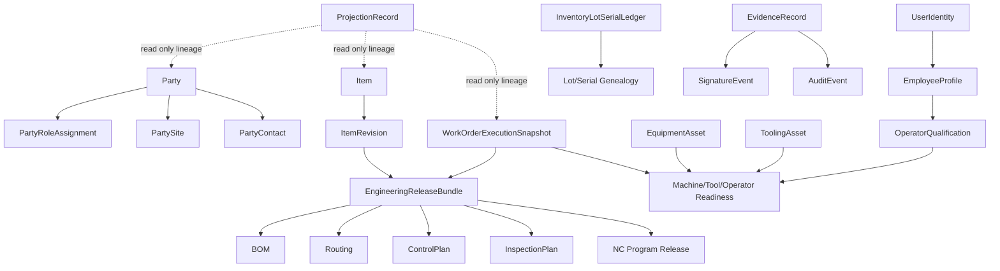

# MDA Root Relationship Graph

## Mandatory relationship rules

1. `PartyRoleAssignment` is a contained child of `Party`, not a separate root.
2. `OperatorQualification` is a link/projection under employee or user identity, not a duplicate person root.
3. `EngineeringReleaseBundle` is the canonical parent for execution-ready BOM/routing/control-plan/inspection-plan/NC definitions.
4. `WorkOrderExecutionSnapshot` stores frozen references to the released engineering bundle and readiness state.
5. `InventoryLotSerialLedger` and genealogy own traceability truth; inventory balances remain projections.
6. Evidence, signature, and audit objects always link back to a parent root and never supersede the parent lifecycle.
