# Kiểm Kê Workflow Và Sơ Đồ Chi Tiết

Ngày lập: 2026-04-04  
Phạm vi: `C:\Users\TEST4\qms.hesem.com.vn`

## 1. Kết luận nhanh

HESEM hiện có 4 lớp workflow khác nhau, cần tách riêng khi đếm:

| Lớp đếm | Số lượng | Ý nghĩa |
|---|---:|---|
| Workflow định nghĩa trong thư viện | 412 | Danh mục workflow trong `workflow-library.json` |
| Domain của thư viện workflow | 48 | Nhóm nghiệp vụ của 412 workflow |
| Template state machine trong `WorkflowEngine` | 12 | Engine dùng chung cho record QMS |
| Workflow canonical đang chạy thực tế trong portal/runtime | 11 | Các luồng vận hành mình xác định là đang active theo `api.php` + service |
| Route/API handler liên quan workflow | 110 | Action handler liên quan workflow trong `api.php` |

Ghi chú quan trọng:

1. Không cộng thẳng `412 + 12 + 11 + 110`, vì đây là 4 lớp khác nhau.
2. `110 route/API handler` không đồng nghĩa `110 workflow`; nhiều route chỉ là snapshot, queue, export, policy hoặc helper action.
3. Đối với vận hành thực tế, con số nên dùng để quản trị là `11 workflow canonical live`.

## 2. Quy tắc đếm

### 2.1 Workflow định nghĩa

Nguồn: `01-QMS-Portal/qms-data/registry/workflow-library.json`

- Đếm theo số key trong object `workflows`
- Kết quả thực tế: `412`
- `_meta.workflowCount` cũng bằng `412`

### 2.2 Workflow engine template

Nguồn: `01-QMS-Portal/api/services/WorkflowEngine.php`

- Đếm theo số workflow type do `buildWorkflowDefinitions()` định nghĩa
- Kết quả: `12`

### 2.3 Workflow live / canonical

Nguồn: `01-QMS-Portal/api.php` và các service nghiệp vụ

- Chỉ tính những luồng có API route, state change, hoặc service thực thi rõ ràng
- Không tính các hàm snapshot thuần đọc là một workflow độc lập

## 3. Phân bố 412 workflow theo domain

| Domain | Số lượng |
|---|---:|
| `mes_execution` | 38 |
| `supplier_relationship` | 16 |
| `quality_management` | 15 |
| `ehs_sustainability` | 14 |
| `outsource_execution` | 13 |
| `bi_datawarehouse` | 13 |
| `project_management` | 12 |
| `(blank)` | 12 |
| `hcm_workforce` | 12 |
| `master_data_governance` | 12 |
| `advanced_planning` | 12 |
| `commercial_contracts` | 12 |
| `finance_extended` | 11 |
| `tooling_lifecycle` | 11 |
| `trade_compliance` | 11 |
| `plant_maintenance` | 11 |
| `quality_lab` | 11 |
| `system_infrastructure` | 10 |
| `mfg_engineering` | 10 |
| `plm_change_control` | 10 |
| `demand_supply_planning` | 10 |
| `warehouse_management` | 10 |
| `service_warranty` | 9 |
| `finance_treasury` | 9 |
| `crm` | 9 |
| `production` | 8 |
| `transportation` | 8 |
| `sales` | 8 |
| `audit_risk` | 6 |
| `traceability_serialization` | 6 |
| `customer_portal` | 6 |
| `shipping_compliance` | 5 |
| `master_data` | 5 |
| `core_system` | 5 |
| `inventory` | 5 |
| `calibration_equipment` | 4 |
| `training_hr` | 4 |
| `fmea_apqp` | 4 |
| `finance` | 4 |
| `purchasing` | 3 |
| `forms_system` | 3 |
| `document_control` | 3 |
| `evidence_vault` | 3 |
| `digital_product_passport` | 2 |
| `cnc_programs` | 2 |
| `record_system` | 2 |
| `ai_predictive` | 2 |
| `mobile_operations` | 1 |

## 4. Phân bố theo chuẩn chính

| Chuẩn / nguồn | Số lượng |
|---|---:|
| `internal` | 320 |
| `AS9100` | 30 |
| `ISO17025` | 15 |
| `ISO14001` | 14 |
| `ITAR/EAR` | 11 |
| `ISO9001` | 8 |
| `AIAG` | 4 |
| `AS9100D §8.4` | 2 |
| `AS9100D §10.2 / ISO 13485` | 1 |
| `MES best practice` | 1 |

## 5. 110 route workflow-related trong `api.php`

Đây là số handler hành động liên quan workflow, không phải số workflow độc lập.

| Nhóm route | Số lượng |
|---|---:|
| `mes_*` | 36 |
| `form_*` | 19 |
| `evidence_*` | 15 |
| `order_*` | 12 |
| `doc_*` | 12 |
| `epicor_*` | 8 |
| `online_*` | 5 |
| `release_followup_*` | 3 |

## 6. 12 workflow template trong `WorkflowEngine`

| Code | Tên workflow | Trạng thái chính |
|---|---|---|
| `DOC` | Document control | `draft -> in_review -> approved -> released -> obsolete` |
| `NCR` | Nonconformance | `open -> containment -> investigation -> disposition -> closed` |
| `CAPA` | Corrective / preventive action | `initiated -> root_cause -> action_plan -> implementation -> verification -> closed` |
| `FAI` | First article inspection | `planned -> in_progress -> review -> approved -> closed` |
| `CAL` | Calibration | `scheduled -> in_progress -> pass/fail -> certified` |
| `AUD` | Audit | `planned -> in_progress -> reporting -> follow_up -> closed` |
| `TRN` | Training | `scheduled -> in_progress -> assessment -> certified` |
| `ECR` | Engineering change request | `submitted -> review -> approved -> implemented -> verified` |
| `SCAR` | Supplier corrective action | `issued -> response_due -> response_received -> verification -> closed` |
| `RISK` | Risk management | `identified -> assessed -> mitigated -> monitored -> closed` |
| `IMP` | Improvement / PDCA | `proposed -> approved -> pdca_do -> pdca_check -> pdca_act -> closed` |
| `MR` | Management review | `scheduled -> in_progress -> minutes_drafted -> approved` |

Nhận xét:

1. `WorkflowEngine` là lớp state machine dùng chung, nhưng không phải toàn bộ 12 template đã được expose thành một module UI hoàn chỉnh.
2. Một số domain đang có service riêng với logic riêng, ví dụ supplier SCAR trong `SupplierQualityService` dùng state machine khác với SCAR trong `WorkflowEngine`.

## 7. 11 workflow canonical đang chạy thực tế

### 7.1 Bảng inventory

| # | Workflow live | Mục đích vận hành | Route / entry point chính | Hàm / service chính | Trạng thái hoặc checkpoint |
|---|---|---|---|---|---|
| 1 | Document HTML release control | Quản lý vòng đời tài liệu HTML | `doc_create`, `doc_save_draft`, `doc_submit_review`, `doc_approve`, `doc_reject`, `doc_start_new_revision` | `load_doc_state`, `save_doc_state`, `load_doc_manifest`, `save_doc_manifest` | `draft`, `in_review`, `approved`, `obsolete` |
| 2 | Excel form blank release control | Quản lý blank form Excel/offline | `form_upload_draft` và nhánh form trong `doc_submit_review`, `doc_approve`, `doc_reject` | `form_bootstrap_release_control`, `form_load_state`, `form_load_manifest`, `form_public_versions` | `draft`, `in_review`, `approved`, `obsolete`, `initial_release` |
| 3 | Online form schema workflow | Quản trị schema online form | `form_schema_save_draft`, `form_schema_submit_review`, `form_schema_publish`, `form_schema_reject`, `form_schema_rollback` | `online_schema_save_draft_working_copy`, `online_schema_submit_review_working_copy`, `online_schema_publish_release`, `online_schema_reject_review`, `online_schema_rollback_to_draft` | `draft`, `in_review`, `approved`, `obsolete`, `initial_release` |
| 4 | Record allocation + online/offline instance lifecycle | Cấp mã, theo dõi 1 record instance xuyên suốt | `record_id_next`, `form_fill_download_offline`, `form_fill_submit_online`, `upload_submit`, `form_fill_download_received` | `AllocationService`, `allocation_append_event`, `allocation_status_normalize` | `ALLOCATED`, `DOWNLOADED`, `SUBMITTED`, `RECEIVED`, `ARCHIVED`, `VOIDED`, `AUTO-VOIDED`, `REJECTED` |
| 5 | Evidence review + approval + SLA | Kiểm tra bằng chứng, phê duyệt, reopen, SLA | `evidence_checklist`, `evidence_submit_for_review`, `evidence_review`, `evidence_reopen`, `evidence_sla_status`, `evidence_sla_notifications_run`, `evidence_get_pending` | `evidence_evaluate_checklist`, `evidence_review_sla_materialize`, `evidence_refresh_approval_summary` | `submitted`, `in_review`, `approved`, `rejected`, `reopened` |
| 6 | Release rollout follow-up | Theo dõi triển khai sau release tài liệu/form | `release_followup_overview`, `release_followup_update` | `release_followup_register_release`, `release_followup_summary`, `release_followup_queue_rows` | `open`, `in_progress`, `completed` và queue state `due_soon`, `overdue` |
| 7 | Order workflow `SO -> JO -> WO` | Điều hành đơn hàng, job, work order | `order_*` | `OrderWorkflowService::validateTransition`, `executeTransition`, `validateFieldEdit`, `executeFieldEdit` | SO, JO, WO có state machine riêng |
| 8 | MES execution governance | Điều hành launch, machine, alarm, NC, tool, traceability, downtime | `mes_*` | `build_mes_snapshot`, `MesNcReleaseService`, `MesToolOffsetService`, `MesAlarmService`, `MesAdapterService` | Không phải 1 state machine tuyến tính; là tập checkpoint/gate vận hành |
| 9 | Epicor integration workflow | Đồng bộ inbound/outbound, reconciliation, outbox | `epicor_*` | `EpicorIntegrationService`, `OutboxWorker`, `EpicorInboundWorker` | `sync_run`, `reconciliation_exception`, `outbox_event`, transport health |
| 10 | Supplier quality workflow | Incoming, skip-lot, scorecard, SCAR, audit, ASL | service + dashboard supplier | `SupplierQualityService::createIncoming`, `updateSkipLotLevel`, `calculateScorecard`, `createScar`, `transitionScar`, `upsertAudit`, `upsertAsl` | Incoming result, skip-lot level, SCAR state, audit / ASL checkpoints |
| 11 | Shipment readiness gate | Chặn/cho phép xuất hàng theo 10 điều kiện | shipment gate service | `ShipmentGateService::checkReadiness`, `getDocumentReadiness`, `getQualityReadiness` | 10 gate `SG-01..SG-10`, kết quả `ready / not ready` |

### 7.2 Trạng thái chi tiết của workflow order

| Entity | Trạng thái |
|---|---|
| `SO` | `draft -> quoted -> confirmed -> in_production -> shipped -> closed`, có nhánh `cancelled` |
| `JO` | `planned -> released -> active <-> on_hold -> completed -> closed` |
| `WO` | `scheduled -> setup -> running -> inspection -> completed`, có nhánh `on_hold` |

### 7.3 Trạng thái chi tiết của supplier SCAR live

Supplier SCAR live trong `SupplierQualityService` hiện chạy theo chuỗi:

`issued -> acknowledged -> root_cause_analysis -> corrective_action -> verification -> closed`

Lưu ý: chuỗi này khác với template `SCAR` trong `WorkflowEngine`.

## 8. Sơ đồ workflow chi tiết

### W1. Document HTML release control

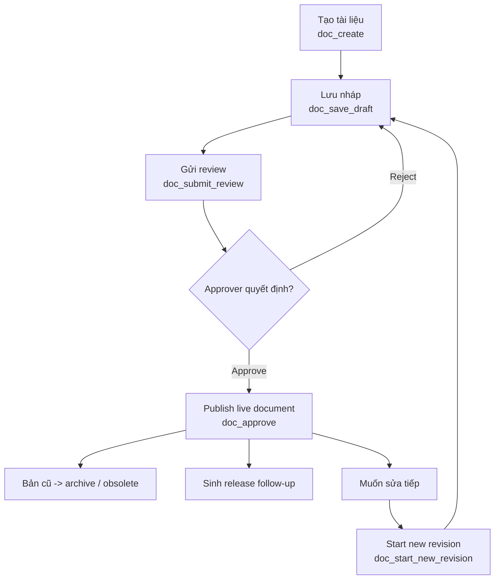

Chức năng hoạt động:

1. Tài liệu chỉ đi live khi qua `doc_approve`.
2. Snapshot `_INREVIEW` và `_DRAFT` được dùng để tránh approve trực tiếp từ DOM phía client.
3. Khi release revision mới, revision cũ bị chuyển sang archive/obsolete.

### W2. Excel form blank release control

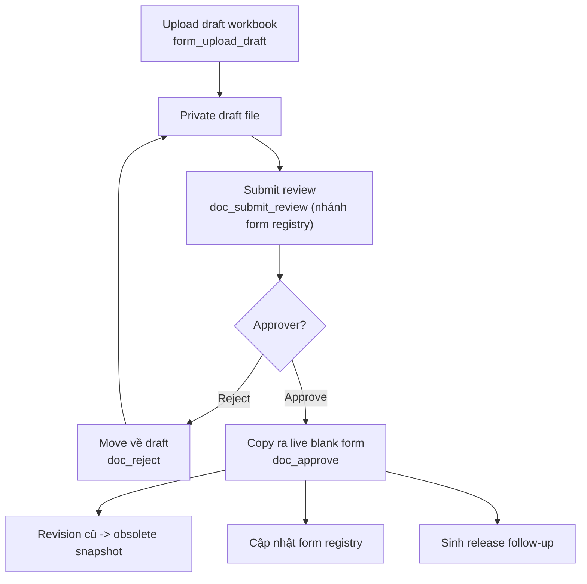

Chức năng hoạt động:

1. Blank Excel dùng private archive ngoài web root để kiểm soát revision.
2. Approval route dùng chung với `doc_approve`, nhưng có nhánh xử lý riêng khi code nằm trong form registry.
3. Metadata checksum và revision được lưu để phục vụ upload validation về sau.

### W3. Online form schema workflow

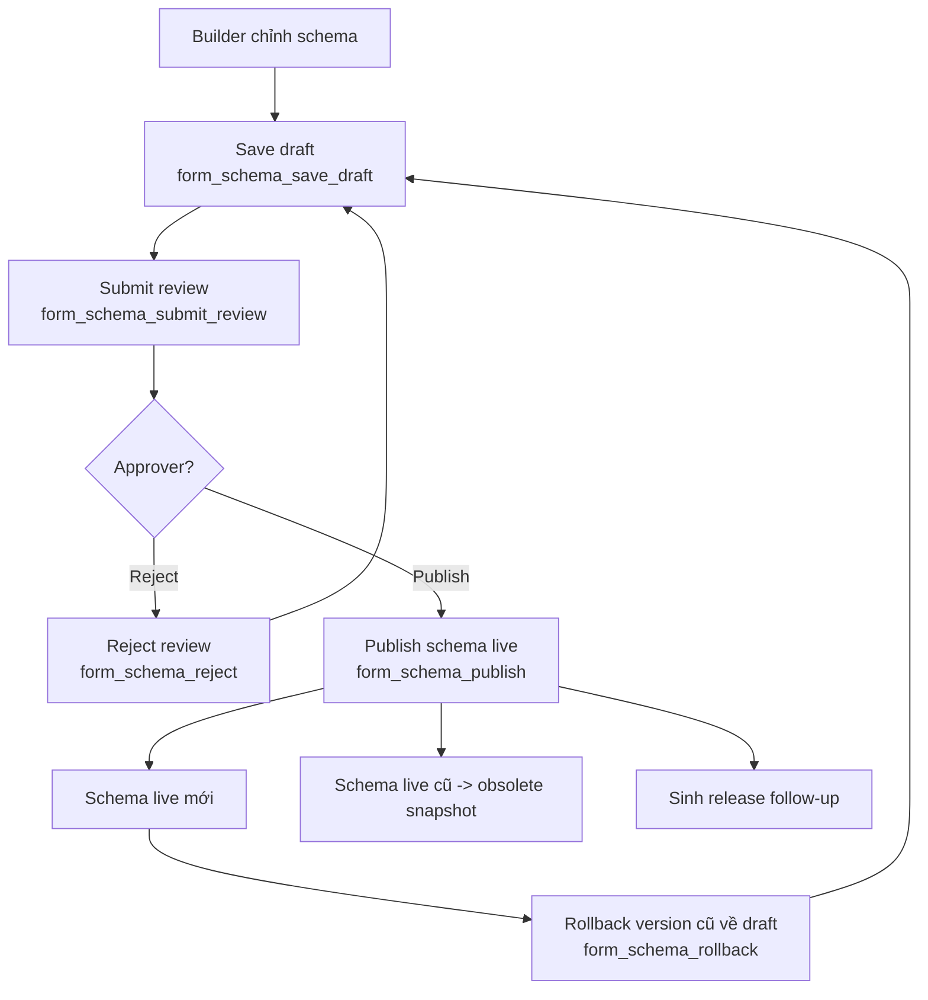

Chức năng hoạt động:

1. Mọi chỉnh sửa ACTIVE schema đều đi qua working draft mới.
2. Publish ghi đè live schema và archive live cũ thành `obsolete`.
3. Rollback không publish ngay; rollback chỉ đưa version cũ về draft để chỉnh tiếp.

### W4. Record allocation + issue + submit

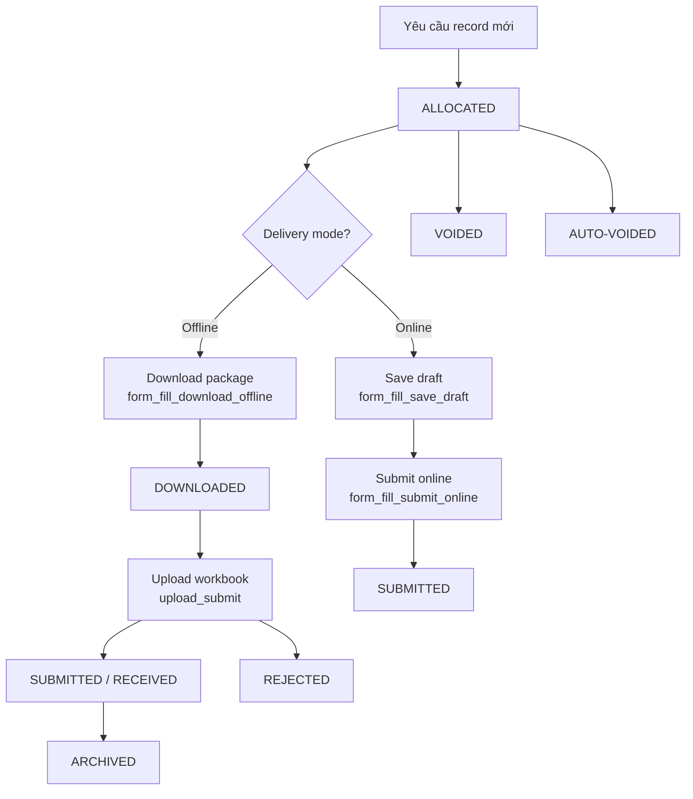

Chức năng hoạt động:

1. Một business case dùng đúng 1 `allocation_id` và 1 `record_id`.
2. Online resubmission và offline re-upload vẫn giữ nguyên mã, chỉ tăng revision/counter.
3. Reject hoặc reopen không cấp mã mới.

### W5. Evidence review + approval + SLA

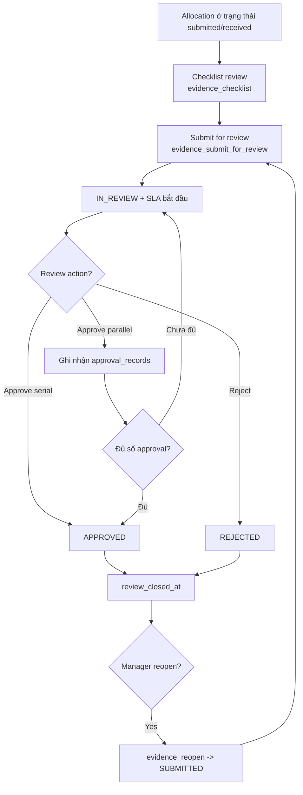

Chức năng hoạt động:

1. Review chỉ bắt đầu khi checklist stage `review` đạt.
2. Approve serial bắt một người đủ quyền; approve parallel tích lũy `approval_records` đến ngưỡng.
3. Reopen xóa outcome cũ và reset SLA.

### W6. Release rollout follow-up

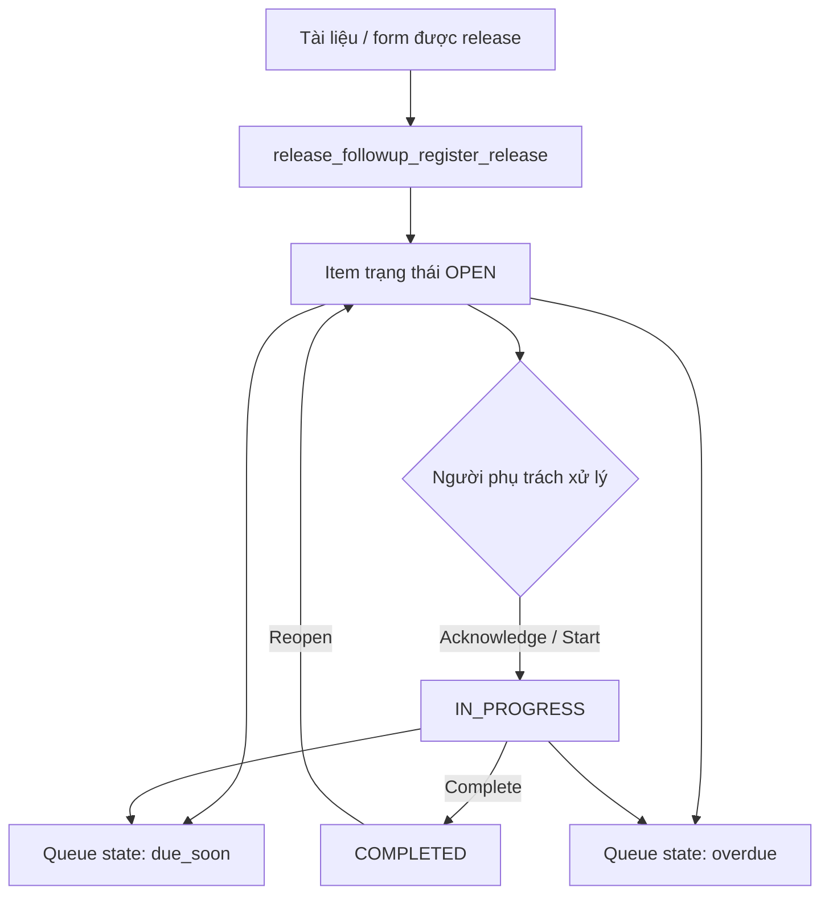

Chức năng hoạt động:

1. Đây là workflow đóng vòng triển khai sau release.
2. `due_soon` và `overdue` là trạng thái queue tính toán, không phải persisted business state riêng.
3. Workflow này hiện đã được hook vào release document HTML, Excel form, và online form schema.

### W7. Order workflow `SO -> JO -> WO`

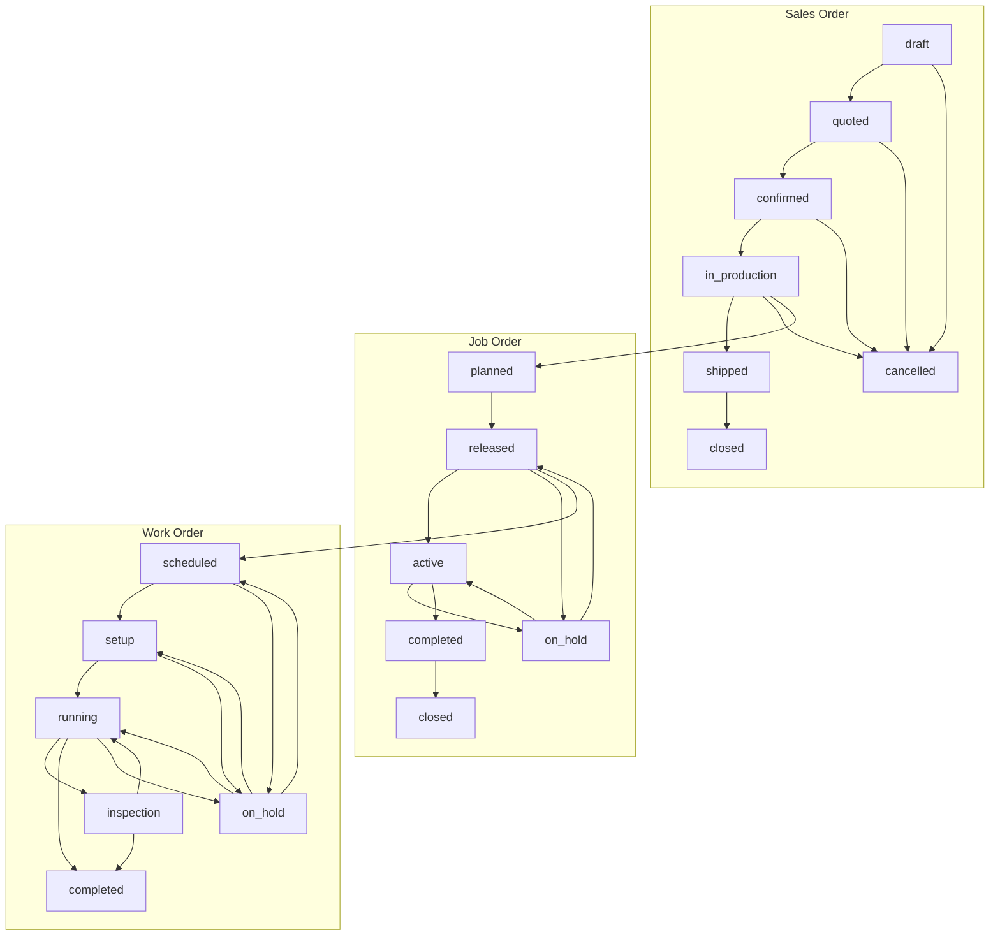

Chức năng hoạt động:

1. `OrderWorkflowService` kiểm soát transition, quyền, cancel/reopen, edit lock và auto-action.
2. SO là container kinh doanh, JO là job sản xuất, WO là operation trên máy.
3. Auto-action hiện có gồm check WO scheduled, check JO tồn tại cho SO, và cập nhật progress JO từ WO.

### W8. MES execution governance

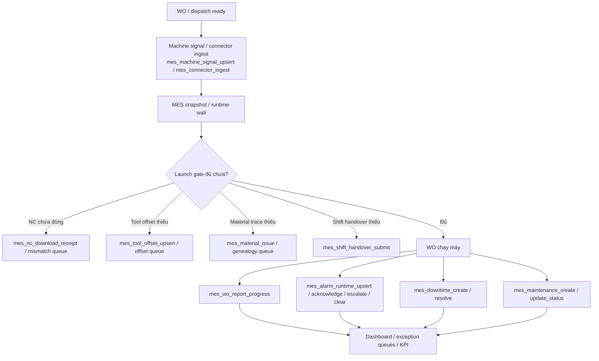

Chức năng hoạt động:

1. MES hiện là governance workflow nhiều checkpoint hơn là state machine tuyến tính.
2. Gate tập trung vào NC release, tool offset, material genealogy, adapter health, alarm, downtime, maintenance, shift handover.
3. Các queue exception được build từ snapshot runtime và dùng để chặn hoặc escalte launch.

### W9. Epicor integration workflow

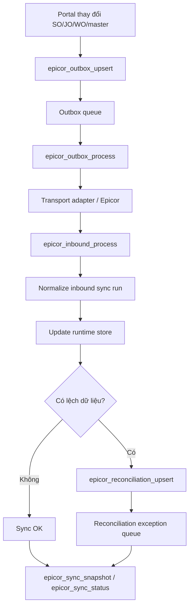

Chức năng hoạt động:

1. Workflow này xoay quanh 3 loại đối tượng: `sync_run`, `reconciliation_exception`, `outbox_event`.
2. `EpicorIntegrationService` chủ yếu normalize dữ liệu và dựng snapshot vận hành.
3. Health của integration còn phụ thuộc policy runtime và transport adapter.

### W10. Supplier quality workflow

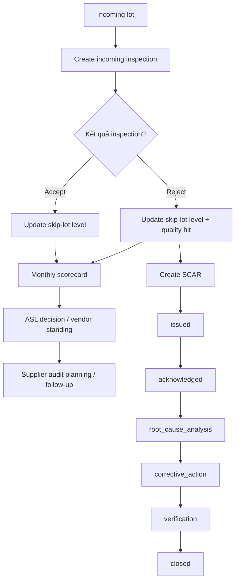

Chức năng hoạt động:

1. Incoming inspection feed vào skip-lot logic ANSI Z1.4 và scorecard nhà cung cấp.
2. SCAR live đang có state machine riêng trong `SupplierQualityService`.
3. ASL và audit đang chạy song song như checkpoint quản trị supplier chứ chưa hợp nhất thành một state machine duy nhất.

### W11. Shipment readiness gate

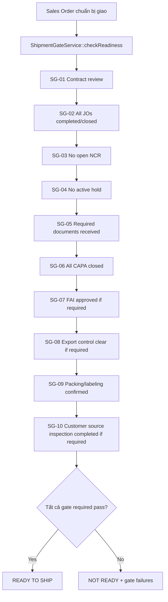

Chức năng hoạt động:

1. Đây là workflow quyết định sẵn sàng giao hàng, không phải luồng tài liệu.
2. `ready = true` chỉ khi toàn bộ gate bắt buộc pass.
3. Gate không bắt buộc có thể trả `na` mà không làm fail tổng.

## 9. Bản đồ file nguồn chính

| Nhóm | File nguồn chính |
|---|---|
| Workflow library | `01-QMS-Portal/qms-data/registry/workflow-library.json` |
| Chuẩn document workflow | `core-standards/09-versioning-and-workflow.md` |
| Chuẩn form/allocation lifecycle | `core-standards/23-form-lifecycle-and-allocation.md` |
| HTML document workflow | `01-QMS-Portal/api.php` |
| Excel form workflow | `01-QMS-Portal/form_workflow.php` |
| Online schema workflow | `01-QMS-Portal/online_schema_workflow.php` |
| Allocation / evidence / follow-up | `01-QMS-Portal/api.php` |
| Generic QMS workflow engine | `01-QMS-Portal/api/services/WorkflowEngine.php` |
| Order workflow | `01-QMS-Portal/api/services/OrderWorkflowService.php`, `01-QMS-Portal/qms-data/config/so_jo_wo_config.json` |
| MES governance | `01-QMS-Portal/api.php`, `01-QMS-Portal/api/services/MesNcReleaseService.php` |
| Epicor integration | `01-QMS-Portal/api/services/EpicorIntegrationService.php` |
| Supplier quality | `01-QMS-Portal/api/services/SupplierQualityService.php` |
| Shipment gate | `01-QMS-Portal/api/services/ShipmentGateService.php` |

## 10. Kết luận quản trị

Nếu mục tiêu là quản trị thực thi, HESEM nên theo dõi 5 dashboard số chính:

1. `412` workflow thư viện để quản trị độ phủ nghiệp vụ.
2. `12` workflow engine template để quản trị chuẩn state machine dùng chung.
3. `11` workflow canonical live để quản trị vận hành thực tế.
4. `110` workflow-related API handlers để quản trị bề mặt tích hợp và kỹ thuật.
5. Trạng thái closure của `release follow-up`, `evidence SLA`, `shipment readiness`, `MES queues`, `Epicor reconciliation`.

Nếu mục tiêu là nâng cấp hệ thống, ưu tiên nên đi theo `11 workflow canonical live` trước, sau đó mới chuẩn hóa hoặc tinh gọn tiếp 412 workflow trong thư viện.
