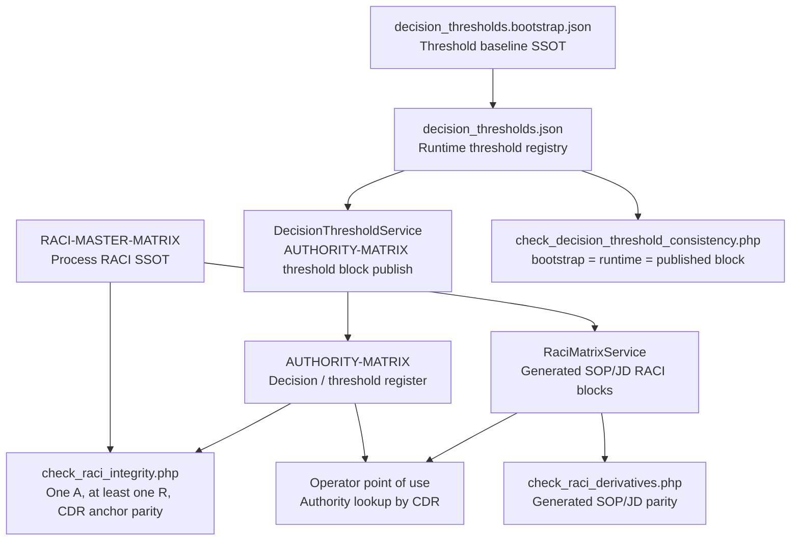

# RACI V3 Source-of-Truth Graph

## Read order

1. `RACI-MASTER-MATRIX` governs process responsibility and gate ownership.
2. `decision_thresholds.bootstrap.json` and `decision_thresholds.json` govern threshold wording for `AUTHORITY-MATRIX`.
3. `AUTHORITY-MATRIX` is the point-of-use decision register generated from the threshold registry and cross-checked against RACI CDR usage.
4. SOP/JD RACI fragments are derivatives only; they must never outrank the master or authority registers.
