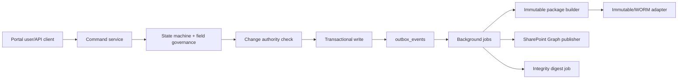

# eQMS / PLM / MOM Control Plane Re-Audit and Target Architecture

Date: 2026-04-13
Repository: `sanhvo86-hesem/mom`
Scope: backend, data model, state governance, publication, retention, genealogy linkage, audit export, and repo promotion discipline.

## Executive Verdict

The repository contains valuable primitives that should be reused: workflow services, hash-chain audit trail, evidence vault concepts, change-control tables, release field-locking, form versioning, registry tooling, migration discipline, and the newer eQMS package/publication services. The flaw is not absence of useful code. The flaw is that controlled records, generated artifacts, publication replicas, form carriers, and change-authorized post-release mutations are not yet governed by one explicit canonical control plane.

This upgrade wave adds the missing spine:

- Migration `106_eqms_world_class_control_plane.sql` creates canonical tables with exact semantics for document revisions, form template revisions, schema versions, issuances, submission attempts, evidence records, evidence versions, artifacts, publication states, change authority, outbox, background jobs, integrity digests, exceptions, and retention locks.
- `EqmsControlPlaneStateMachine` turns compliance principles into executable transitions, guards, roles, evidence requirements, side effects, and domain events.
- Unit tests pin down the most dangerous invariants: no direct final edit, no direct SharePoint upload, post-release change authority required, configured training/read acknowledgement gates enforced, and publication must target read-only distribution.
- Repo hygiene rules prevent new generated screenshots, reports, build outputs, and temp artifacts from being introduced beside controlled source.

This is intentionally additive. Existing `eqms_*` tables and services can continue to operate while command services migrate to the canonical table names.

## A. Strict Re-Audit Report

### P0 Findings

| ID | Finding | Architectural root cause | Concrete remediation |
| --- | --- | --- | --- |
| P0-1 | Final records can still be reasoned about through service-specific state names rather than one authoritative record/version/publication state model. | Evidence, forms, docs, workflow, and publication evolved independently. "Record", "attempt", "version", and "publication" are not uniformly separated in the older schema. | Use the canonical tables in migration 106. Route every finalization, amendment, publication, and retention command through `EqmsControlPlaneStateMachine` and a command service that writes outbox events. |
| P0-2 | Post-release edit controls are not yet universal by object/field/effectivity. | Change authority exists but is not a mandatory guard for every released object mutation path. | Enforce `field_governance_rules` before commit. If object is released/final/locked/published, require released `plm_change_orders` and a matching affected/resulting/effectivity rule. |
| P0-3 | Offline Excel can be treated by users as a file workflow unless issuance and attempt ledgers are first-class. | Hidden sheets, QR, and metadata can be carriers, but current concepts need canonical issuance and submission-attempt objects. | Use `frm_issuances` for controlled download and `frm_submission_attempts` for every upload, validation result, duplicate detection, and quarantine decision. |
| P0-4 | SharePoint publication can be confused with source-of-truth storage unless the UI/API and backend block input semantics. | Publication and storage concerns are not strictly separated in all layers. | `evidence_publications` is a replica-state table only. Publication state machine requires `read_only_distribution_target` and rejects `direct_user_upload`. SharePoint adapter must remain asynchronous Graph publication only. |
| P0-5 | Immutable package completeness is not yet guaranteed at the canonical evidence-version boundary. | Evidence artifacts and package builder exist, but package completeness is not a schema-level invariant everywhere. | Treat final evidence version as invalid unless it has original artifact, canonical payload, readable snapshot, hash/signature manifest, and publication receipt or state record. |
| P0-6 | Repository root mixes controlled source with generated reports, prompts, screenshots, browser artifacts, temp outputs, build outputs, and deleted/archive folders. | The repo lacks source/runtime/publication/report segregation and promotion-manifest discipline. | Ignore new generated artifacts, define release/promotion conventions, move existing generated artifacts in a controlled cleanup branch, and require promotion manifest/receipt for releases. |
| P0-7 | WORM/immutability is a design principle but not yet represented as a uniform adapter and retention-lock lifecycle across all evidence package writes. | Local storage and package builder exist, but retention/legal hold is not a unified bounded context. | Use `retention_locks`, immutable storage adapter contracts, and retention state transitions. Make package builder write through adapter facade and persist lock state. |

### P1 Findings

| ID | Finding | Architectural root cause | Concrete remediation |
| --- | --- | --- | --- |
| P1-1 | Template revision and schema version semantics are still easy to collapse mentally. | Older form concepts tie visual template, schema, and workbook delivery too closely. | Use `frm_template_revisions` for controlled carrier/template and `frm_schema_versions` for canonical payload contract. Every issuance references both. |
| P1-2 | Affected objects, resulting objects, effectivity, WIP disposition, and release impact are not yet a complete change-authority graph. | Change tables exist but do not yet model release impact as a navigation surface and command guard for every controlled object. | Use `plm_change_affected_objects`, `plm_change_resulting_objects`, and `plm_change_effectivities` as the released-change authority graph. |
| P1-3 | Training/read-and-understand gates are not uniformly bound to effectivity. | Training service concepts exist, but release gating is not fully integrated with document/form/change effectivity. | Use `plm_change_training_requirements` plus `doc_distributions` and `doc_read_acknowledgements`; release transition requires both training and read acknowledgement gates when configured. |
| P1-4 | Publication lacks a full retry/dead-letter/withdraw/supersede operational model. | Publication service exists but must be promoted into background-job and state-machine semantics. | Use `evidence_publications` plus `background_jobs`; state machine covers pending, queued, publishing, published, failed, retry_scheduled, dead_letter, withdrawn, superseded. |
| P1-5 | Audit-pack export is not first-class. | Audit trail, package builder, and records exist separately. | Add an exporter service that gathers evidence package, field diffs, signatures, publication receipts, change authority, genealogy links, and integrity digest verification into an intelligible bundle. |
| P1-6 | Periodic evaluation and exception registers are not yet operational control surfaces. | Integrity digest and exception concepts are separate from management review workflows. | Use `integrity_digests`, `integrity_exceptions`, and effectiveness reviews as periodic evaluation feeds. |
| P1-7 | Outbox/event architecture exists in parallel forms. | `domain_outbox_events`, generic outbox, and worker concepts are not unified around eQMS commands. | Keep existing workers while adding `outbox_events` canonical table. Bridge old publishers to canonical outbox until migration is complete. |
| P1-8 | Genealogy/as-manufactured linkage is not yet a first-class eQMS query contract. | MES traceability and evidence vault are adjacent but not exposed as one graph. | Add graph read model endpoints linking lot/batch/serial/job, 5M context, documents, changes, evidence records, and publications. |

### P2 Findings

| ID | Finding | Architectural root cause | Concrete remediation |
| --- | --- | --- | --- |
| P2-1 | Naming varies across `eqms_*`, `plm_*`, `doc_*`, and service names. | Evolutionary design without canonical dictionary. | Keep aliases only as compatibility. New APIs use canonical nouns in migration 106. |
| P2-2 | Registry/generated schema files are modified during tooling runs and appear in normal status. | Generated metadata lives beside controlled source. | Write generated registry outputs to ignored report folders or explicitly promote via release manifest. |
| P2-3 | Browser screenshots and prompt files clutter audit review. | Human working artifacts are stored beside deployable source. | Move prompts/screenshots into ignored work folders or controlled documentation areas only when approved. |
| P2-4 | Frontend/API error taxonomy is not yet standardized for compliance blockers. | Each service returns local errors. | Standardize `state_conflict`, `change_authority_required`, `issuance_invalid`, `duplicate_submission`, `publication_failed`, `effectivity_gate_not_met`, `record_locked`, and `retention_locked`. |

## B. Target-State Architecture

### Bounded Contexts

1. Document Control
   - Owns document family, document revision, lifecycle, effectivity, distribution, read acknowledgement, supersession, withdrawal, and obsolete state.
   - Does not store final evidence as a SharePoint object. SharePoint is a publication target only.

2. Form and Template Control
   - Owns form family, template revision, schema version, render profile, naming policy, issuance policy, and carrier generation.
   - Template revision is the controlled carrier/display artifact. Schema version is the canonical payload contract. Issuance is the controlled allocation/download/session object.

3. Evidence Control
   - Owns issuance, submission attempt, evidence record, evidence version, artifacts, package manifest, signatures, and publication state.
   - Evidence record is the business object. Files are carriers/artifacts. Final versions are append-only.

4. Change Authority
   - Owns change request, change order, affected objects, resulting objects, effectivity, WIP disposition, training requirements, verification, and effectiveness review.
   - Any post-release mutation command asks this context for authority before commit.

5. Genealogy / Manufacturing Traceability
   - Owns lot/batch/serial/job linkage and as-built/as-manufactured context.
   - Links 5M context references to documents, forms, evidence, changes, deviations, and release packets.

6. Publication and Retention
   - Owns asynchronous Graph publication, publication state machine, immutable storage adapter, retention locks, legal hold, and audit export.
   - SharePoint is read-only distribution and discovery. It is never the authoritative record store and never an upload UI.

7. Audit and Integrity
   - Owns append-only audit events, field-level diffs, hash chain verification, daily integrity digests, exception register, and periodic evaluation inputs.

### Command Flow



All user input enters through portal APIs. Background workers may publish replicas, build packages, calculate digests, and retry dead letters. They do not bypass command guards.

## C. Detailed Data Model

Migration: `database/migrations/106_eqms_world_class_control_plane.sql`.

### Document Control

| Table | Purpose | Critical controls |
| --- | --- | --- |
| `doc_families` | Stable SOP/WI/ANNEX/FRM/SPEC family. | Unique `doc_code`, owner, active/inactive/retired family state. |
| `doc_revisions` | Controlled document revision. | Unique family revision and sequence, lifecycle state, source change order, manifest hash, idempotency key, row version. |
| `doc_effectivities` | Effective date/scope for revision. | Scope as JSONB, from/to, source change order. |
| `doc_distributions` | Audience distribution. | Read acknowledgement required flag, distribution state, idempotency. |
| `doc_read_acknowledgements` | Read-and-understand evidence. | Signature event link, acknowledgement hash, idempotency. |

### Form and Template Control

| Table | Purpose | Critical controls |
| --- | --- | --- |
| `frm_families` | Stable form family. | Unique form code, owner, family state, source document link. |
| `frm_template_revisions` | Controlled template/carrier revision. | Template checksum, naming policy, issuance policy, source doc revision/change order. |
| `frm_schema_versions` | Canonical payload contract. | JSON schema, canonicalization rules, validation rules, render profile, independent schema sequence. |
| `frm_issuances` | Controlled issuance/download/session ledger. | Allocation ID, template revision, schema version, delivery mode, issued context, manifest hash, expiry, row version. |
| `frm_submission_attempts` | Every upload/finalize attempt. | Attempt number, state, original hash, parsed payload, validation errors, duplicate link, idempotency. |

### Evidence Control

| Table | Purpose | Critical controls |
| --- | --- | --- |
| `evidence_records` | Business evidence object. | Subject linkage, current version, record state, retention policy, source change order. |
| `evidence_versions` | Immutable version line. | Version number, version state, issuance/attempt link, canonical payload hash, snapshot hash, manifest hash, change order. |
| `evidence_artifacts` | Original/canonical/snapshot/manifest/signature/publication receipt artifacts. | Artifact role, hash, storage URI, immutable flag. |
| `evidence_publications` | Read-only publication replica state. | Target system/library/path, state, retry count, receipt hash, last error. |
| `signature_events` | Electronic signature facts. | Signature meaning, payload hash, signer, reason, append-only trigger. |

### Change Authority

| Table | Purpose | Critical controls |
| --- | --- | --- |
| `plm_change_affected_objects` | Objects impacted by proposed/released change. | Object type/id/version/field scope, impact type, WIP disposition. |
| `plm_change_resulting_objects` | New/revised objects authorized by change. | Result action, target version, release state. |
| `plm_change_effectivities` | Where/when change applies. | Effective from/to, scope, activation state. |
| `plm_change_training_requirements` | Training/read-and-understand gates. | Training object, audience, due date, gate state. |
| `plm_change_verifications` | Verification plan/results. | Protocol, state, result, evidence link. |
| `plm_change_effectiveness_reviews` | Effectiveness review lifecycle. | Due date, state, outcome, evidence link. |
| `field_governance_rules` | Object/field mutability policy. | Lifecycle-state match, change requirement, allowed roles, direct edit flag. |

### Jobs, Integrity, Retention

| Table | Purpose | Critical controls |
| --- | --- | --- |
| `outbox_events` | Transactional domain event outbox. | Aggregate, event type, payload, idempotency key, processing state. |
| `background_jobs` | Async job ledger. | Job type, status, attempts, next run, dead-letter fields. |
| `integrity_digests` | Periodic hash/digest register. | Scope, digest date, object count, previous digest hash. |
| `integrity_exceptions` | Integrity and governance exceptions. | Severity, state, detection/correction fields. |
| `retention_locks` | Retention/WORM/legal hold abstraction. | Object, lock type/state, retain until, legal hold ref, unique active lock. |

## D. Detailed State Machines

Executable definitions live in `api/services/ControlPlane/EqmsControlPlaneStateMachine.php`.

### Document Revision

| From | To | Roles | Required evidence | Guards | Side effects |
| --- | --- | --- | --- | --- | --- |
| draft | in_review | author, qa_qms | draft_payload | none | lock editable baseline |
| in_review | approved | reviewer, qa_qms | review_decision | none | record review signature |
| approved | released | qa_qms, approver | approval_signature, release_manifest | none | create effectivity, enqueue distribution, enqueue publication |
| released | superseded | qa_qms, change_coordinator | released_change_order | released change order | close distribution, link supersession |
| released | obsolete | qa_qms, change_coordinator | released_change_order, withdrawal_justification | released change order | withdraw distribution |

### Form Issuance

Issued offline Excel must come from `frm_issuances`. Download writes a receipt. Upload creates a `frm_submission_attempt`. Issued/downloaded carriers can be voided, expired, or superseded, but not silently overwritten.

### Submission Attempt

Received -> parsing -> validating -> valid/invalid/duplicate/quarantined -> accepted/rejected.

Duplicate detection is a terminal branch unless QA explicitly rejects or resolves through a new controlled attempt. Accepted attempts create evidence versions.

### Evidence Record and Evidence Version

Evidence record states: open, under_review, finalized, superseded, voided, retained, legal_hold.

Evidence version states: draft, validating, ready_for_review, locked, superseded, voided.

Locked versions cannot return to draft. Finalized records cannot be directly edited. Supersession/void requires released change order and replacement or void evidence.

### Publication

Pending -> queued -> publishing -> published.

Failure path: publishing -> failed -> retry_scheduled -> queued, or failed -> dead_letter when retry attempts are exhausted. Published replicas can be withdrawn or superseded only with released change authority.

Guard: publication queue requires read-only distribution target and rejects direct user upload.

### Change Request and Change Order

Change request: draft -> submitted -> triage -> approved_for_order/rejected/cancelled.

Change order: draft -> impact_assessment -> in_review -> approved -> released -> implemented -> closed.

Release requires release manifest, verification passed, training gate complete, and read acknowledgement gate complete when applicable.

### Verification and Effectiveness Review

Verification: planned -> in_progress -> passed/failed, or planned -> waived with risk acceptance.

Effectiveness review: scheduled -> due -> in_review -> effective/ineffective, or due -> overdue.

## E. Detailed Migration Plan

1. Deploy migration 106 additively. Do not drop or rename existing `eqms_*` tables in the same release.
2. Backfill families and revisions:
   - Map existing document definitions into `doc_families` and `doc_revisions`.
   - Map existing form templates into `frm_families`, `frm_template_revisions`, and `frm_schema_versions`.
3. Backfill evidence:
   - Create `evidence_records` for existing business records.
   - Create one `evidence_versions` row for each final package or file set.
   - Register all known original, canonical, snapshot, manifest, and receipt files in `evidence_artifacts`.
4. Backfill publication:
   - Treat existing SharePoint references as `evidence_publications` with state `published` only when a receipt/hash exists.
   - Otherwise use `pending` or `failed` with reason.
5. Backfill change authority:
   - For released controlled objects, create affected/resulting object links to known change orders.
   - Where no authority exists, create an integrity exception instead of inventing authority.
6. Activate write guards:
   - Phase 1: warn-only `field_governance_rules` for non-critical objects.
   - Phase 2: block final evidence/document/form paths.
   - Phase 3: block all released controlled objects.
7. Cut over APIs:
   - New endpoints write canonical tables.
   - Old endpoints read through compatibility adapters until retired.

Rollback plan: migration 106 is additive. If rollout fails before cutover, stop workers and leave existing services on prior tables. If cutover has started, replay `outbox_events` after fixing command logic; do not mutate final records directly.

## F. Service and Module Refactor Plan

### `WorkflowEngine.php`

Current strength: centralized transition and role ideas.

Required change:
- Delegate eQMS lifecycle transition definitions to `EqmsControlPlaneStateMachine`.
- Require transition result before workflow persistence.
- Emit canonical `outbox_events` after transition commit.
- Preserve existing workflow definitions for non-eQMS flows until migration.

### `AuditTrail.php`

Current strength: hash-chain/event audit logic.

Required change:
- Add field-level before/after diffs for controlled object commands.
- Include state machine transition id, required evidence ids, change order id, and package manifest hash.
- Feed daily `integrity_digests`.

### `EvidenceVaultService.php`

Current strength: SHA-256 custody, evidence linking, vault concepts.

Required change:
- Make immutable package builder mandatory before evidence version lock.
- Persist `evidence_artifacts` for original artifact, canonical payload, readable snapshot, hash/signature manifest, and publication receipt/state. Package manifests must expose canonical `readable_snapshot_hash_sha256` while preserving legacy `snapshot_hash_sha256` callers during migration.
- Write through immutable storage adapter abstraction.
- Prevent package replacement after locked/finalized state.

### `OrderWorkflowService.php`

Current strength: operational workflow and shopfloor linkage.

Required change:
- Require active document/form effectivity and training/read acknowledgement before execution actions that depend on controlled SOP/WI/form revisions.
- Emit genealogy links from job/order execution to evidence records and changes.

### Change Control Migrations and Services

Required change:
- Route all post-release object mutation checks through a `ChangeAuthorityService` backed by `plm_change_affected_objects`, `plm_change_resulting_objects`, `plm_change_effectivities`, and `field_governance_rules`.
- Require exact object type, object id, field scope, effectivity, and action match. Broad change orders should be explicit wildcard policies, not accidental fallthrough.

### Docs, Standards, and Registry

Required change:
- Store normative policy docs under controlled docs paths.
- Store generated registry/report outputs under ignored report paths unless promoted by manifest.
- Make promotion manifest list schema, migration, service, route, test, and documentation changes.

## G. API Contract Plan

Common response envelope:

```json
{
  "data": {},
  "state": {
    "object_type": "evidence_record",
    "object_id": "EVR-100",
    "authoritative_state": "finalized",
    "row_version": 7,
    "immutable": true,
    "available_actions": []
  },
  "warnings": [],
  "errors": []
}
```

Common error:

```json
{
  "error": {
    "code": "change_authority_required",
    "message": "A released change order must authorize this object, field, action, and effectivity.",
    "details": {
      "object_type": "evidence_record",
      "object_id": "EVR-100",
      "field_scope": ["canonical_payload"],
      "required_state": "released"
    },
    "retryable": false
  }
}
```

### Document Control

`GET /api/eqms/documents`

Response includes family, latest released revision, current effectivity, distribution state, and publication state.

`POST /api/eqms/documents/{familyId}/revisions`

Request:

```json
{
  "revision_label": "B",
  "source_change_order_id": "CO-2026-001",
  "canonical_payload": {},
  "idempotency_key": "doc-rev-B-001"
}
```

State-aware blockers: duplicate revision, change required, source document invalid, row version conflict.

### Issuance and Offline Download

`POST /api/eqms/forms/{familyId}/issuances`

Request:

```json
{
  "template_revision_id": "uuid",
  "schema_version_id": "uuid",
  "delivery_mode": "offline_excel",
  "issued_to_ref": "operator-123",
  "issued_for_context": {
    "work_order": "WO-100",
    "lot": "LOT-20"
  },
  "idempotency_key": "issue-WO-100-FRM-10"
}
```

Response includes allocation id, issuance state, expiry, manifest hash, download URL, and warnings about training/effectivity.

`POST /api/eqms/issuances/{issuanceId}/download-receipt`

Records controlled carrier download. No direct SharePoint location is returned as upload destination.

### Offline Upload Validation

`POST /api/eqms/issuances/{issuanceId}/submission-attempts`

Multipart original artifact plus idempotency key.

Response:

```json
{
  "data": {
    "submission_attempt_id": "uuid",
    "attempt_state": "invalid",
    "original_hash_sha256": "64hex",
    "validation_errors": [
      {
        "code": "schema_mismatch",
        "field": "inspection_result",
        "message": "Value is not allowed by schema version 3."
      }
    ],
    "duplicate_detection": {
      "is_duplicate": false,
      "duplicate_of_attempt_id": null,
      "match_reason": null
    }
  }
}
```

Duplicate response:

```json
{
  "error": {
    "code": "duplicate_submission",
    "message": "This artifact hash was already submitted for the issuance.",
    "details": {
      "duplicate_of_attempt_id": "uuid",
      "match_reason": "same_issuance_same_original_hash"
    },
    "retryable": false
  }
}
```

### Online Form Runtime and Finalization

`GET /api/eqms/issuances/{issuanceId}/runtime`

Returns render profile, schema version, draft state, row version, finalization gates, and disabled controls.

`POST /api/eqms/issuances/{issuanceId}/finalize`

Request:

```json
{
  "payload": {},
  "row_version": 4,
  "signature": {
    "meaning": "operator_final_submit",
    "reason": "completed batch record"
  },
  "idempotency_key": "finalize-issuance-uuid"
}
```

Server authoritative: schema validation, finalization lock, signature event, canonical payload hash, package creation.

### Amendment

`POST /api/eqms/evidence-records/{recordId}/amendments`

Request:

```json
{
  "source_version_id": "uuid",
  "change_order_id": "CO-2026-009",
  "amendment_reason": "Correct transcribed equipment id",
  "field_scope": ["equipment_id"],
  "idempotency_key": "amend-EVR-100-1"
}
```

Response returns new draft evidence version. Final record remains immutable.

### Evidence Search and Retrieval

`GET /api/eqms/evidence-records?subject_type=lot&subject_id=LOT-20`

Response includes record state, current version, package completeness, retention lock, publication state, and genealogy links.

`GET /api/eqms/evidence-versions/{versionId}/package`

Returns signed URLs/handles for original, canonical, snapshot, manifest, signature events, and publication receipt/state record.

### Version Compare

`GET /api/eqms/evidence-records/{recordId}/versions/compare?from=1&to=2`

Response:

```json
{
  "data": {
    "record_id": "uuid",
    "from_version": 1,
    "to_version": 2,
    "field_diffs": [],
    "artifact_diffs": [],
    "change_authority": {
      "change_order_id": "CO-2026-009",
      "authorized": true
    }
  }
}
```

### Change Request and Change Order

`POST /api/plm/change-orders/{changeOrderId}/affected-objects`

Requires object type, object id, version label, field scope, impact type, WIP disposition, and effectivity.

`POST /api/plm/change-orders/{changeOrderId}/release`

Server checks verification, training, read acknowledgement, release manifest, and object impact matrix.

### Training Gate

`GET /api/plm/change-orders/{changeOrderId}/training-gate`

Returns required, complete, overdue, waived, and blockers by audience.

### Publication Monitor

`GET /api/eqms/publications?state=failed`

Returns failed publications, retry eligibility, dead-letter reason, target path, and source evidence version.

`POST /api/eqms/publications/{publicationId}/retry`

Allowed only for failed/retry_scheduled states and correct roles.

### Audit Pack Export

`POST /api/eqms/audit-packs`

Request:

```json
{
  "scope": {
    "lot": "LOT-20",
    "work_order": "WO-100",
    "date_from": "2026-04-01",
    "date_to": "2026-04-13"
  },
  "include": ["evidence", "documents", "changes", "signatures", "publication", "genealogy", "integrity"]
}
```

Response returns background job id and later an export manifest with hashes.

### Genealogy Traceability Queries

`GET /api/mom/genealogy/graph?lot=LOT-20`

Returns nodes and edges for lot/batch/serial/job, materials, equipment, personnel, process parameters, documents, forms, evidence, change orders, deviations, and publication receipts.

## H. Background Jobs and Outbox Design

Use transaction outbox for every command that affects controlled records.

Event examples:
- `DocumentRevisionReleased`
- `FormIssuanceIssued`
- `SubmissionAttemptAccepted`
- `EvidenceVersionLocked`
- `EvidenceRecordFinalized`
- `PublicationQueued`
- `PublicationFailed`
- `ChangeOrderReleased`
- `IntegrityDigestComputed`

Job types:
- `build_evidence_package`
- `publish_sharepoint_graph`
- `retry_publication`
- `export_audit_pack`
- `compute_integrity_digest`
- `evaluate_periodic_review`
- `create_training_tasks`
- `verify_retention_lock`

Dead-letter rule:
- After max attempts, mark `background_jobs.job_state = dead_letter`, keep `last_error`, emit integrity exception, and keep the source record unchanged.

Idempotency:
- Commands use request idempotency keys.
- Workers use aggregate id plus event id plus job type as idempotency.
- Publication retry must not create duplicate final records; it can only update publication state/receipt.

## I. Repo Hygiene Cleanup Plan

Current root contains mixed artifacts:
- `_reports`, `_build`, `_Deleted`, `.tmp`, `.tmp-*.png`
- Prompt files and operational documents beside source
- Browser-test outputs and screenshots
- Runtime logs and generated registry/schema reports

Rules added now:
- `.gitignore` prevents new report/build/temp/screenshot/cache artifacts.

Required cleanup branch:
1. Inventory tracked generated artifacts with `git ls-files`.
2. Move controlled documents into `mom/docs/...` only when they are normative.
3. Move prompts and experiments into ignored working folders or separate prompt repository.
4. Move publication/export samples into `mom/docs/examples` only if sanitized and useful.
5. Keep runtime data under ignored runtime folders.
6. Require release manifest before promoting generated schema/registry files.

## J. World-Class Feature Roadmap

### Change Impact Explorer

Graph UI/API over affected objects, resulting objects, effectivity, training, WIP disposition, documents, forms, evidence records, lots, serials, and jobs.

### Affected/Resulting Object Browser

Filter by change order, object type, object state, release readiness, and effectivity conflicts.

### Effectivity Manager

Calendar/scope editor for date/site/plant/product/lot/serial/order/role effectivity. Must preview impacted WIP and training audience.

### Training Task Auto-Trigger

On `ChangeOrderReleased`, create tasks from `plm_change_training_requirements` and block execution until complete where policy requires it.

### Read-and-Understand Gate

Distribution plus acknowledgement tracking for SOP/WI revisions. Execution entitlement checks active acknowledgement.

### Evidence Package Compare View

Backend diff of canonical payload, artifact manifest, signatures, publication receipt, and change authority.

### Audit Pack Export Bundle

ZIP or package with manifest, hashes, human-readable index, original artifacts, canonical JSON, readable snapshots, signatures, publication receipts, audit trail, and genealogy graph.

### Unified Graph API

Expose cross-object traceability graph with stable node types and edge types.

### Publication Monitor API

Dashboard for pending, queued, publishing, published, failed, retry, dead-letter, withdrawn, and superseded publication states.

### Periodic Evaluation API

Register due reviews, integrity exceptions, failed publications, overdue training, and effectiveness reviews.

### Retention/Immutability Adapter Abstraction

Support local filesystem, S3 object lock, Azure immutable blob, and future WORM vault adapters behind one interface.

## K. Test Strategy

Unit tests:
- State machine transition coverage.
- Field governance rule evaluator.
- Change authority exact object/field/effectivity match.
- Package builder completeness.
- Publication target read-only guard.
- Duplicate detection logic.

Integration tests:
- Offline issuance -> download receipt -> upload -> validation -> accepted attempt -> evidence version -> final package.
- Online runtime -> draft save -> finalize -> lock -> amendment.
- Change order -> affected/resulting/effectivity -> verification -> training/read acknowledgement -> release.
- Publication worker success/failure/retry/dead-letter.
- Audit pack export.

Migration safety tests:
- Migration 106 applies on empty and existing database.
- Existing `eqms_*` tables can coexist.
- Append-only triggers block update/delete on signature/artifact/final version tables.
- Unique idempotency constraints reject replay conflicts.

Security/compliance tests:
- Direct final record update blocked.
- SharePoint direct upload rejected.
- Expired issuance rejected.
- Wrong schema version rejected.
- Duplicate original hash detected.
- Change authority missing/wrong state/wrong field/wrong effectivity rejected.
- Training/read acknowledgement not met blocks release/execution where policy requires.

Integrity tests:
- Hash manifest verifies original/canonical/snapshot/signature/publication receipt.
- Daily digest links to previous digest.
- Tamper simulation creates integrity exception.

## L. Rollout Plan by Wave

Wave 0: inventory and freeze
- Freeze direct edits to final evidence paths.
- Inventory generated artifacts and controlled source boundaries.
- Deploy migration 106 to dev only.

Wave 1: canonical write spine
- Introduce state-machine checks.
- Add command service facade for document/form/evidence/change commands.
- Write `outbox_events` for new commands.
- Keep legacy endpoints read-compatible.

Wave 2: offline/online form control
- Enforce issuance ledger for offline downloads.
- Enforce submission attempts and duplicate detection for uploads.
- Enforce online finalize/lock/amendment path.

Wave 3: evidence package and publication
- Require immutable package builder before evidence lock.
- Activate publication worker with retry/dead-letter.
- Persist publication state/receipt.

Wave 4: change authority and effectivity
- Enforce field governance rules for final/released objects.
- Activate affected/resulting/effectivity model.
- Add WIP disposition and training/read acknowledgement gates.

Wave 5: genealogy and audit pack
- Add unified graph API.
- Add audit pack export.
- Add periodic evaluation dashboard feeds.

Wave 6: retention/WORM adapters
- Activate immutable storage adapter in production.
- Apply retention locks and legal holds.
- Run integrity digests and exception review cadence.

## M. Definition of Done

The upgrade is done when:
- Every controlled final record has a canonical evidence record and evidence version.
- Final evidence package includes original artifact, canonical structured payload, readable snapshot, hash/signature manifest, and publication receipt or publication state record.
- Offline Excel cannot be downloaded without issuance and cannot be accepted without validation against issuance/template/schema.
- Online form finalization locks the version and amendment creates a new version.
- SharePoint publication is asynchronous, read-only, and never an upload path.
- Any post-release mutation without matching released change order is rejected.
- Training/read acknowledgement gates are visible and enforceable.
- Publication retry/dead-letter is auditable.
- Audit pack export is intelligible to an auditor without source-code knowledge.
- Migration/backfill scripts are idempotent and tested.
- Repo release has manifest, promotion receipt, and no unpromoted generated artifacts.

## N. Patch Plan by File/Path

Implemented in this wave:
- `database/migrations/106_eqms_world_class_control_plane.sql`
- `api/services/ControlPlane/EqmsControlPlaneStateMachine.php`
- `tests/Unit/Services/EqmsControlPlaneStateMachineTest.php`
- `docs/backend/EQMS_CONTROL_PLANE_REAUDIT_AND_TARGET_ARCHITECTURE.md`
- `.gitignore`
- `release/CONTROLLED_PROMOTION_CONVENTIONS.md`

Next patch candidates:
- `api/services/WorkflowEngine.php`: adapter to `EqmsControlPlaneStateMachine`.
- `api/services/AuditTrail.php`: field-level diffs and transition evidence.
- `api/services/EvidenceVaultService.php`: package-builder enforcement and artifact persistence.
- `api/services/ControlPlane/DomainOutboxService.php`: bridge to canonical `outbox_events`.
- `api/services/Publication/*`: worker state persistence to `evidence_publications` and `background_jobs`.
- `api/services/ChangeControl/ChangeAuthorityService.php`: exact object/field/effectivity guard against migration 106 tables.
- `api/routes/*`: new eQMS control-plane endpoints.

## O. Explicit Deprecation List

Deprecate:
- Treating SharePoint path as evidence source of truth.
- Direct user upload to SharePoint for controlled forms or evidence.
- Treating offline Excel hidden metadata as a security boundary.
- Accepting uploaded offline forms without issuance match.
- Updating final evidence/document/form records in place.
- Using template revision and schema version interchangeably.
- Publishing without durable publication state/receipt.
- Release without affected/resulting objects and effectivity where scope changes.
- Release without training/read acknowledgement gates where policy requires them.
- Generated screenshots/reports/build artifacts in controlled source root.
- Any operational manual workaround that creates evidence outside portal command APIs.
